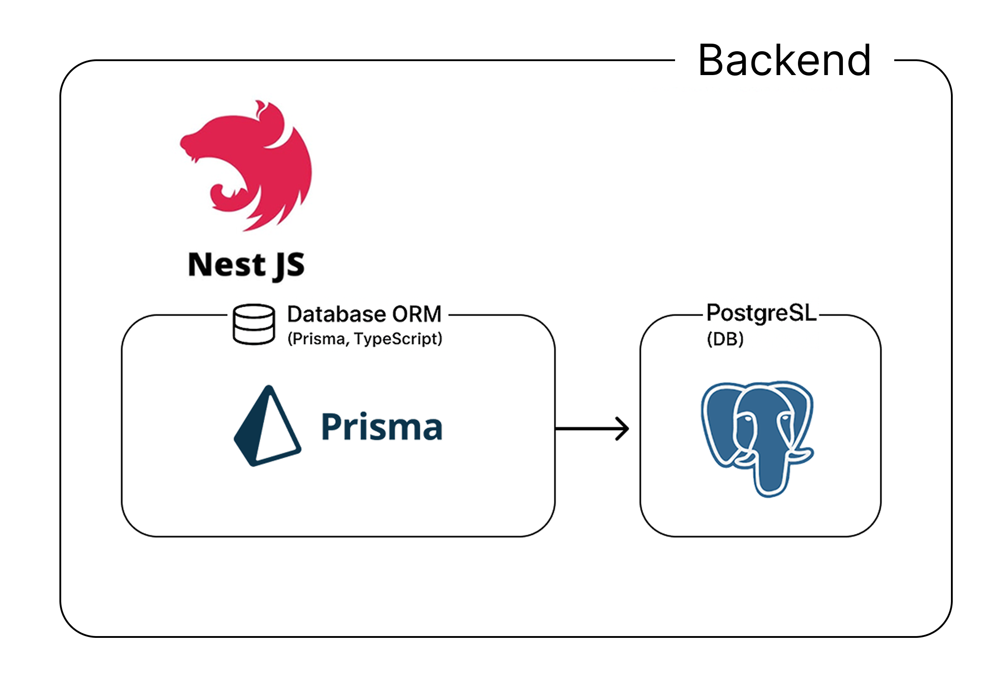

# 🚌 가슈 - 고령자 대상 AI 교통 도우미 프로젝트의 백엔드 실험 레포

## 🚏 노선 기반 실시간 버스 위치 추적 백엔드 설계
- NestJS를 기반 **노선 기반 실시간 버스 위치 확인**을 위한 백엔드 아키텍처를 구성  
- 직접 노선 API, 버스 위치 API 등을 조합(Join)
- 사용자의 현재 위치 → 목적지까지의 정류장 흐름 추적 
- 실시간 도착 정보를 연결하는 로직을 설계, 구현

---

## 🔍 기능 흐름 및 API 설계

### ▶️ API 활용 흐름

1. **`station/nearby`**  
   - 프론트에서 전달받은 **현재 위치 (경도/위도)**를 기반으로  
     주변 정류장 리스트를 받아옴  
   - 여기서 **상행/하행 각각 1개씩 nodeId 추출**

2. **`route/routeno`**  
   - 프론트에서 전달된 **버스 번호(routeNo)** 를 기반으로  
     **routeId** 를 받아옴

3. **목적지 정류장 탐색**
   - 목적지 경도/위도 기반으로 다시 `station/nearby` 호출  
   - 목적지 근처 정류장의 **nodeId** 확보

4. **ROUTE_STATION 테이블 조인**  
   - 위의 nodeId, routeId를 기반으로  
     버스 노선에서 **정류장 순서** 확인  
   - 이를 통해 **상행/하행 방향 구분**

5. **실제 버스 도착 시간 확인**
   - 최종 nodeId를 `arrival/nodeid` API에 넣어  
     **실시간 남은 시간 확인**
     
---

## 🧱 데이터베이스 설계 및 쿼리 전략

- `ROUTE`, `STATION`, `ROUTE_STATION` 테이블 설계
- 복수 nodeId, routeId 조건 기반의 조인 쿼리 작성
- 정류장 순서 번호(`station_order`)를 기준으로 상·하행 판단

---

---
## 🔗 프로젝트 링크
🗂️ [프론트레포](https://github.com/gashu-android-app/gashu-app-android.git)
🗂️ [백앤드레포](https://github.com/gashu-android-app/gashu-backend.git)
📒 [팀 노션](https://www.notion.so/1f1800c9877b8000a4e9fc894388a939?source=copy_link)

